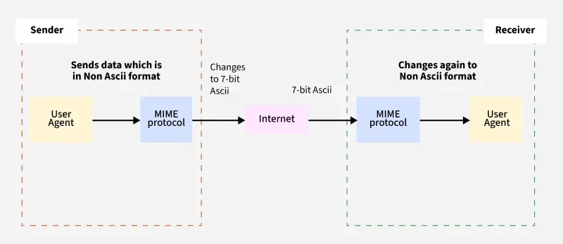

# Where Does MCP Fit?

This is where things get really interesting.

**MCP = Model Context Protocol.**

It is fundamentally different from OKF.

A useful distinction is:

|                            | **OKF**                         | **MCP**                                          |
| -------------------------- | ------------------------------- | ------------------------------------------------ |
| **What is it?**            | Knowledge representation format | Protocol                                         |
| **Main purpose**           | Represent knowledge             | Connect AI applications to external capabilities |
| **Basic unit**             | Knowledge bundle / concept      | Server / tool / resource / prompt                |
| **Typical representation** | Markdown + YAML                 | Protocol messages / JSON                         |
| **Think of it as**         | **“How knowledge is packaged”** | **“How an agent accesses capabilities”**         |
| **Runtime required?**      | No                              | Yes                                              |
| **Search engine?**         | No                              | No                                               |
| **Database?**              | No                              | No                                               |

The current MCP specification describes MCP as the protocol layer for connecting AI applications with external systems, with capabilities such as **tools, resources, and prompts**. The July 2026 specification also introduced a stateless protocol core and strengthened authorization.

So:

> **OKF describes knowledge. MCP exposes capabilities.**

---

# What OKF Actually Is

The simplest mental model is:

> **OKF is a portable, human-readable knowledge representation format — not a database, not RAG, and not an API protocol.**

An OKF knowledge bundle is essentially:

```text
knowledge-bundle/
│
├── index.md
├── log.md
│
├── projects/
│   ├── index.md
│   ├── project-alpha.md
│   └── project-beta.md
│
├── services/
│   ├── payment-service.md
│   └── auth-service.md
│
└── teams/
    └── backend-team.md
```

Each concept is a Markdown file containing:

**YAML frontmatter + Markdown body**

For example, conceptually:

```yaml
---
type: Service
title: Payment Service
description: Handles payment processing
resource: https://...
tags: [payments, backend]
---
```

followed by Markdown describing the service and linking it to other concepts.

The important part is that relationships can be expressed through links between concepts.

So:

```text
payment-service.md
        │
        │ owned by
        ▼
backend-team.md
```

can become traversable knowledge.

---

# Think About the Notion API Model

This is the first thing I want you to understand before implementation.

A Notion page is not simply:

```text
Page
└── content: "some huge string"
```

Instead, Notion's content is structured into **blocks**.

Conceptually:

```text
Page
│
├── Page metadata
│   ├── ID
│   ├── URL
│   ├── title
│   ├── created time
│   └── last edited time
│
└── Blocks
    ├── paragraph
    ├── heading
    ├── paragraph
    ├── bulleted list
    ├── code
    ├── image
    └── ...
```

This distinction matters a lot for our eventual knowledge pipeline.

```text
Notion API JSON
        ↓
Extract page metadata
        ↓
Extract block content
        ↓
Flatten/normalize rich text
        ↓
Preserve document structure
        ↓
Store normalized JSON
```

The important point is:

> **Don't throw away information too aggressively yet.**

We want to extract the information useful for our agent while retaining enough metadata for retrieval, citations, permissions, and future graph construction.

---

# Notion Connector: Three Processing Layers

For the Notion connector, I suggest we think about processing in three layers.

## 1. Page-Level Information

From `/pages/{id}`, keep:

- `page_id`
- `title`
- `url`
- `created_time`
- `last_edited_time`
- `parent`
- `created_by`
- `last_edited_by`

The most important ones initially are:

- **`page_id`** → stable source identifier
- **`title`** → useful for retrieval/citations
- **`url`** → source citation
- **`last_edited_time`** → synchronization later
- **`parent`** → hierarchy/context

We don't need to carry the entire raw page JSON forward.

---

## 2. Block-Level Information

From `/blocks/{id}/children`, we want to transform blocks into meaningful **text + structure**.

For example:

```text
heading_1
"Architecture"

paragraph
"The backend uses FastAPI."

bulleted_list_item
"Neo4j is used for graph storage."
```

becomes something conceptually like:

```json
[
  {
    "type": "heading",
    "text": "Architecture"
  },
  {
    "type": "paragraph",
    "text": "The backend uses FastAPI."
  },
  {
    "type": "list_item",
    "text": "Neo4j is used for graph storage."
  }
]
```

We're essentially converting:

```text
Notion-specific JSON
        ↓
Useful structured knowledge
```

The reason we don't simply extract every `plain_text` value and concatenate it is that **structure carries meaning**.

For example:

```text
Architecture

FastAPI

PostgreSQL
```

is more useful than:

```text
Architecture FastAPI PostgreSQL
```

when we eventually chunk and retrieve it.

---

## 3. Preserve Source Information

Every extracted piece should still know where it came from.

Conceptually:

```json
{
  "page_id": "...",
  "page_title": "Project Architecture",
  "page_url": "...",
  "block_id": "...",
  "block_type": "paragraph",
  "text": "Backend uses FastAPI."
}
```

Why?

Later, if the agent says:

> The backend uses FastAPI.

we need to know:

- Which page?
- Which part of the page?
- What URL should I cite?

It also becomes important for updating/deleting knowledge when the Notion page changes.

---

# The Extraction Pipeline

Therefore, our extraction pipeline should be:

```text
Page API
    │
    ▼
Page metadata
    │
    ▼
Fetch blocks
    │
    ├── pagination ─────────┐
    │                       │
    ▼                       │
Block                       │
    │                       │
    ├── has_children?       │
    │       │               │
    │      yes              │
    │       ▼               │
    │   fetch children ─────┘
    │
    ▼
Extract useful content
    │
    ▼
Normalized Document
```

And this is another reason I would separate **retrieval from normalization**:

```text
retrieve_page()
retrieve_all_blocks()
        ↓
complete Notion data
        ↓
normalize()
        ↓
our Document model
```

That way, `normalize()` can assume we've already attempted to retrieve the complete page tree.

One more subtle point: we should also preserve the **hierarchy**, rather than flattening everything immediately. A heading, toggle, list, and nested block can carry contextual meaning.

We can flatten later during chunking if that's the best retrieval strategy.

---

# Do We Need a Database Model?

Yes, but **not necessarily a database model yet**.

For our project, I recommend having a small **data model for the normalized representation**. It gives us a clear contract between the Notion connector and everything downstream.

Think of three levels:

```text
Notion API JSON
      ↓
Notion-specific models
      ↓
Normalized Knowledge Document
      ↓
OKF
```

## 1. Do We Need Models for Raw Notion Responses?

**No, not initially.**

We can work with the API JSON dictionaries while learning the Notion structure.

For example:

```python
page = response.json()
blocks = response.json()
```

Creating models for every Notion API object would add unnecessary complexity right now.

---

## 2. Do We Need a Model for Our Normalized Document?

**Yes.**

Something conceptually like:

```python
class Document:
    source: str
    source_id: str
    title: str
    url: str
    created_at: ...
    updated_at: ...
    content: list[ContentBlock]
```

And:

```python
class ContentBlock:
    block_id: str
    type: str
    text: str
```

I would use **Pydantic** for these because we're building a Python/FastAPI system.

The benefit isn't just type checking. It establishes a contract:

```text
Notion Connector
       ↓
    Document
       ↓
Processing pipeline
```

The processing pipeline can trust that every `Document` has the expected structure regardless of where it came from.

Later:

```text
Notion ──┐
Slack ───┤
GitHub ──┤──→ Document
Drive ───┘
```

That's where the model becomes particularly valuable.

---

# One Important Distinction

I wouldn't make this model overly detailed yet.

Don't create:

```text
NotionPageModel
NotionParagraphModel
NotionHeadingModel
NotionCodeModel
NotionCalloutModel
...
```

unless we actually need them.

For our current stage, I'd keep it simple:

```text
Document
└── ContentBlock
```

This gives us a clean foundation without prematurely coupling the normalized knowledge model to every detail of the Notion API.

# Where Does MCP Fit?

This is where things get really interesting.

**MCP = Model Context Protocol.**

It is fundamentally different from OKF.

A useful distinction is:

|                            | **OKF**                         | **MCP**                                          |
| -------------------------- | ------------------------------- | ------------------------------------------------ |
| **What is it?**            | Knowledge representation format | Protocol                                         |
| **Main purpose**           | Represent knowledge             | Connect AI applications to external capabilities |
| **Basic unit**             | Knowledge bundle / concept      | Server / tool / resource / prompt                |
| **Typical representation** | Markdown + YAML                 | Protocol messages / JSON                         |
| **Think of it as**         | **“How knowledge is packaged”** | **“How an agent accesses capabilities”**         |
| **Runtime required?**      | No                              | Yes                                              |
| **Search engine?**         | No                              | No                                               |
| **Database?**              | No                              | No                                               |

The current MCP specification describes MCP as the protocol layer for connecting AI applications with external systems, with capabilities such as **tools, resources, and prompts**. The July 2026 specification also introduced a stateless protocol core and strengthened authorization.

So:

> **OKF describes knowledge. MCP exposes capabilities.**

---

# What OKF Actually Is

The simplest mental model is:

> **OKF is a portable, human-readable knowledge representation format — not a database, not RAG, and not an API protocol.**

An OKF knowledge bundle is essentially:

```text
knowledge-bundle/
│
├── index.md
├── log.md
│
├── projects/
│   ├── index.md
│   ├── project-alpha.md
│   └── project-beta.md
│
├── services/
│   ├── payment-service.md
│   └── auth-service.md
│
└── teams/
    └── backend-team.md
```

Each concept is a Markdown file containing:

**YAML frontmatter + Markdown body**

For example, conceptually:

```yaml
---
type: Service
title: Payment Service
description: Handles payment processing
resource: https://...
tags: [payments, backend]
---
```

followed by Markdown describing the service and linking it to other concepts.

The important part is that relationships can be expressed through links between concepts.

So:

```text
payment-service.md
        │
        │ owned by
        ▼
backend-team.md
```

can become traversable knowledge.

---

# Think About the Notion API Model

This is the first thing I want you to understand before implementation.

A Notion page is not simply:

```text
Page
└── content: "some huge string"
```

Instead, Notion's content is structured into **blocks**.

Conceptually:

```text
Page
│
├── Page metadata
│   ├── ID
│   ├── URL
│   ├── title
│   ├── created time
│   └── last edited time
│
└── Blocks
    ├── paragraph
    ├── heading
    ├── paragraph
    ├── bulleted list
    ├── code
    ├── image
    └── ...
```

This distinction matters a lot for our eventual knowledge pipeline.

```text
Notion API JSON
        ↓
Extract page metadata
        ↓
Extract block content
        ↓
Flatten/normalize rich text
        ↓
Preserve document structure
        ↓
Store normalized JSON
```

The important point is:

> **Don't throw away information too aggressively yet.**

We want to extract the information useful for our agent while retaining enough metadata for retrieval, citations, permissions, and future graph construction.

---

# Notion Connector: Three Processing Layers

For the Notion connector, I suggest we think about processing in three layers.

## 1. Page-Level Information

From `/pages/{id}`, keep:

- `page_id`
- `title`
- `url`
- `created_time`
- `last_edited_time`
- `parent`
- `created_by`
- `last_edited_by`

The most important ones initially are:

- **`page_id`** → stable source identifier
- **`title`** → useful for retrieval/citations
- **`url`** → source citation
- **`last_edited_time`** → synchronization later
- **`parent`** → hierarchy/context

We don't need to carry the entire raw page JSON forward.

---

## 2. Block-Level Information

From `/blocks/{id}/children`, we want to transform blocks into meaningful **text + structure**.

For example:

```text
heading_1
"Architecture"

paragraph
"The backend uses FastAPI."

bulleted_list_item
"Neo4j is used for graph storage."
```

becomes something conceptually like:

```json
[
  {
    "type": "heading",
    "text": "Architecture"
  },
  {
    "type": "paragraph",
    "text": "The backend uses FastAPI."
  },
  {
    "type": "list_item",
    "text": "Neo4j is used for graph storage."
  }
]
```

We're essentially converting:

```text
Notion-specific JSON
        ↓
Useful structured knowledge
```

The reason we don't simply extract every `plain_text` value and concatenate it is that **structure carries meaning**.

For example:

```text
Architecture

FastAPI

PostgreSQL
```

is more useful than:

```text
Architecture FastAPI PostgreSQL
```

when we eventually chunk and retrieve it.

---

## 3. Preserve Source Information

Every extracted piece should still know where it came from.

Conceptually:

```json
{
  "page_id": "...",
  "page_title": "Project Architecture",
  "page_url": "...",
  "block_id": "...",
  "block_type": "paragraph",
  "text": "Backend uses FastAPI."
}
```

Why?

Later, if the agent says:

> The backend uses FastAPI.

we need to know:

- Which page?
- Which part of the page?
- What URL should I cite?

It also becomes important for updating/deleting knowledge when the Notion page changes.

---

# The Extraction Pipeline

Therefore, our extraction pipeline should be:

```text
Page API
    │
    ▼
Page metadata
    │
    ▼
Fetch blocks
    │
    ├── pagination ─────────┐
    │                       │
    ▼                       │
Block                       │
    │                       │
    ├── has_children?       │
    │       │               │
    │      yes              │
    │       ▼               │
    │   fetch children ─────┘
    │
    ▼
Extract useful content
    │
    ▼
Normalized Document
```

And this is another reason I would separate **retrieval from normalization**:

```text
retrieve_page()
retrieve_all_blocks()
        ↓
complete Notion data
        ↓
normalize()
        ↓
our Document model
```

That way, `normalize()` can assume we've already attempted to retrieve the complete page tree.

One more subtle point: we should also preserve the **hierarchy**, rather than flattening everything immediately. A heading, toggle, list, and nested block can carry contextual meaning.

We can flatten later during chunking if that's the best retrieval strategy.

---

# Do We Need a Database Model?

Yes, but **not necessarily a database model yet**.

For our project, I recommend having a small **data model for the normalized representation**. It gives us a clear contract between the Notion connector and everything downstream.

Think of three levels:

```text
Notion API JSON
      ↓
Notion-specific models
      ↓
Normalized Knowledge Document
      ↓
OKF
```

## 1. Do We Need Models for Raw Notion Responses?

**No, not initially.**

We can work with the API JSON dictionaries while learning the Notion structure.

For example:

```python
page = response.json()
blocks = response.json()
```

Creating models for every Notion API object would add unnecessary complexity right now.

---

## 2. Do We Need a Model for Our Normalized Document?

**Yes.**

Something conceptually like:

```python
class Document:
    source: str
    source_id: str
    title: str
    url: str
    created_at: ...
    updated_at: ...
    content: list[ContentBlock]
```

And:

```python
class ContentBlock:
    block_id: str
    type: str
    text: str
```

I would use **Pydantic** for these because we're building a Python/FastAPI system.

The benefit isn't just type checking. It establishes a contract:

```text
Notion Connector
       ↓
    Document
       ↓
Processing pipeline
```

The processing pipeline can trust that every `Document` has the expected structure regardless of where it came from.

Later:

```text
Notion ──┐
Slack ───┤
GitHub ──┤──→ Document
Drive ───┘
```

That's where the model becomes particularly valuable.

---

# One Important Distinction

I wouldn't make this model overly detailed yet.

Don't create:

```text
NotionPageModel
NotionParagraphModel
NotionHeadingModel
NotionCodeModel
NotionCalloutModel
...
```

unless we actually need them.

For our current stage, I'd keep it simple:

```text
Document
└── ContentBlock
```

This gives us a clean foundation without prematurely coupling the normalized knowledge model to every detail of the Notion API.

---

Exactly. One page ID is only our unit of processing, not the scope of the connector.

We ultimately need to synchronize the entire set of Notion pages that our integration is allowed to access.

The architecture becomes:

```text
                    Notion Workspace
                          │
                          ▼
                  Discover accessible pages
                          │
             ┌────────────┼────────────┐
             ▼            ▼            ▼
          Page A        Page B       Page C
             │            │            │
             ▼            ▼            ▼
          Extract      Extract      Extract
             │            │            │
             └────────────┼────────────┘
                          ▼
                    Normalize
                          ▼
                    Knowledge Store
```

The important part: synchronization

We don't want to repeatedly process every page.

We need to distinguish:

NEW
MODIFIED
UNCHANGED

and eventually:

DELETED / NO LONGER ACCESSIBLE

For each page, we already get useful information from Notion such as:

page_id
last_edited_time

So we can maintain something like:

Our metadata store

| page_id | last_synced_at | source_updated_at |
| :--- | :--- | :--- |
| A | 10:00 | 09:55 |
| B | 10:02 | 10:02 |
| C | 10:03 | 09:40 |


When synchronization runs:

```text
Notion
│
▼
Discover pages
│
▼
Compare page metadata
│
├── New → process
├── Modified → process again
└── Unchanged → skip
```

For example:

Notion says:

Page A → last edited = 10:30
Our store → last processed = 10:00

10:30 > 10:00
↓
Re-process Page A

But:

Page B → last edited = 10:00
Our store → last processed = 10:00

same
↓
skip
One important architectural decision

We should not overwrite everything blindly when a page changes.

The lifecycle should eventually be:

Notion Page
↓
Retrieve latest version
↓
Parse
↓
Normalize
↓
Replace/update old representation
↓
Re-index

Because if the content changed, the old:

chunks
embeddings
keyword index entries
graph relationships

may no longer be valid.

So eventually a modification triggers something like:

```text
Page modified
│
▼
Re-extract
│
▼
Re-normalize
│
├── Update vector index
├── Update keyword index
└── Update graph
```
But don't implement synchronization yet

For our current stage, I would keep the problem separated:

Stage 1

Given page_id
↓
retrieve complete page
↓
parse
↓
normalize

Stage 2

Discover all accessible pages
↓
identify new/changed pages
↓
call Stage 1 for each

This is a very important design principle: the page processor should not care whether a page was discovered for the first time or because it changed. It simply receives a page ID and produces the latest representation.

Then the synchronization layer decides which page IDs need processing.

So yes, your understanding is correct: the final connector is a synchronization system, not just a single-page API client. The single-page flow we're building now is the core processing unit that the later sync mechanism will repeatedly invoke.

---

```text
                    Email Connector
                          │
             ┌────────────┴────────────┐
             ▼                         ▼
        GmailConnector          OutlookConnector
             │                         │
        Gmail API              Microsoft Graph
             │                         │
             └────────────┬────────────┘
                          ▼
                  Normalized Email
                          │
                          ▼
                         OKF
                          │
              ┌───────────┼───────────┐
              ▼           ▼           ▼
           Vector       Keyword      Graph
             DB           DB           DB
```

---

Don't just extract:

subject
body

For your Enterprise Knowledge Agent, an email should become something closer to:

```json
{
"id": "provider-specific-id",
"source": "gmail",
"thread_id": "...",

"subject": "Project Alpha Update",

"sender": {
"name": "John Smith",
"email": "john@example.com"
},

"recipients": [
{
"name": "Alice",
"email": "alice@example.com"
}
```
],

"cc": [],

"timestamp": "2026-08-23T10:30:00Z",

"body": "...",

"attachments": [],

"labels": ["INBOX"],

"metadata": {
"is_read": true
}
}

Then transform that into your OKF representation.

---

MIME representation most commonly refers to MIME types (Multipurpose Internet Mail Extensions) in computing, which tell a web browser or email client what kind of file or data it is receiving.Computing and Internet (MIME Type / Media Type)Definition: A standard way of describing the nature and format of a document, file, or piece of data (e.g., text/html, image/jpeg, or application/json).Structure: It uses a type and a subtype separated by a forward slash (type/subtype), such as audio/mpeg.Purpose: It helps software systems (like web servers and browsers) understand how to handle, display, or execute incoming files correctly.Performing Arts (Theatrical Mime)Definition: A form of silent art where an actor communicates a story, emotion, or character using only physical gestures, body movements, and facial expressions without speech.

---



---

1. First, what is this endpoint?

You are looking at:

GET https://gmail.googleapis.com/gmail/v1/users/{userId}/messages

Break it down:

https://gmail.googleapis.com
```text
│
└── Gmail API server
```

/gmail
```text
│
└── Gmail API
```

/v1
```text
│
└── API version 1
```

/users/{userId}
/messages
```text
│
└── resource being requested
```

So in plain English:

"Using version 1 of Google's Gmail API, give me the messages belonging to this user."

For our application:

GET /gmail/v1/users/me/messages

means:

"Give me the messages in the mailbox of the currently authenticated Gmail user."

Google specifically documents me as a special value representing the authenticated user.

2. What is v1?

v1 means:

Version 1 of the API.

It's an API version identifier, not a Python version, Gmail version, HTTP version, etc.

Think about an API as a contract between your application and Google.

Suppose Google initially creates:

/gmail/v1/...

and promises:

GET /gmail/v1/users/me/messages

works in a particular way.

Years later Google might need to introduce a fundamentally different API:

/gmail/v2/...

Now they can have:

/gmail/v1/users/me/messages

and

/gmail/v2/users/me/messages

coexist while applications migrate.

This is why you frequently see:

/api/v1/...

in REST APIs.

3. Why not just /gmail/users/me/messages?

Because APIs evolve.

Imagine your application is built in 2026:

Your Application
↓
Gmail API v1

Google changes the API in 2028.

If they completely changed the behavior of the existing endpoint, your application could suddenly break.

Instead, API versioning allows:

```text
                  Google API
                     │
            ┌────────┴────────┐
            ▼                 ▼
          v1 API            v2 API
            │                 │
       Old applications    New applications
```

The old contract can remain available while newer clients use the new contract.

4. Is v1 the first version ever?

Not necessarily.

This is an important distinction.

v1 usually means the first stable/public version of that particular API contract, not necessarily:

"Google has only ever had one version of this API."

APIs can have:

v1
v2
v3

and sometimes intermediate versions or revisions.

You should treat the version as part of the API's public interface.

5. Now let's understand the complete endpoint

You have:

GET https://gmail.googleapis.com/gmail/v1/users/{userId}/messages

There are several concepts here.

GET

This is the HTTP method.

It means:

"I want to retrieve something."

For example:

GET → retrieve
POST → create/send
PUT/PATCH → update
DELETE → delete

For our email connector, we'll mostly be using GET.

gmail.googleapis.com

This is the API server / host.

Your Python program sends an HTTP request to this server.

Conceptually:

```text
Your Python program
│
│ HTTPS request
▼
gmail.googleapis.com
│
▼
Gmail API
│
▼
Your mailbox
```
/gmail

This identifies the Gmail API service.

/v1

API version.

v1 = Version 1
/users/{userId}

This identifies whose mailbox we're talking about.

For example:

/users/me

or potentially:

/users/user@example.com

But in our application we'll use:

users/me

because we're accessing the mailbox belonging to the authenticated user.

/messages

This identifies the resource.

We're asking for Gmail messages.

So:

/users/me/messages

means:

messages belonging to the authenticated user.

6. What does {userId} mean?

The {} notation means:

This is a variable/path parameter.

The documentation says:

/users/{userId}/messages

But we don't literally send:

/users/{userId}/messages

We replace {userId}.

For our application:

/users/me/messages

The API then understands:

me → authenticated Gmail account

## 7. What are query parameters?

You also saw:

maxResults
pageToken
q
labelIds[]
includeSpamTrash

These are query parameters.

They come after ?.

For example:

GET https://gmail.googleapis.com/gmail/v1/users/me/messages?maxResults=5

Here:

?maxResults=5

is a query parameter.

You can have multiple:

?maxResults=5&includeSpamTrash=true

Conceptually:

```text
Endpoint
│
├── Path parameters
│
└── Query parameters
```

## 8. Why does Gmail have q?

This one is particularly useful for our connector.

Gmail API supports Gmail's search syntax.

For example:

q=from:alice@example.com

or:

q=subject:project

or:

q=after:2026/08/01

or:

q=from:alice@example.com after:2026/08/01

So our connector can do:

```python
service.users().messages().list(
userId="me",
q="after:2026/08/01",
maxResults=100
)
```

instead of downloading everything.

This will become very useful when we implement incremental/filtered ingestion.

9. What does maxResults do?

You saw:

Maximum number of messages to return. Default 100. Maximum 500.

So:

maxResults=5

means:

Give me at most 5 messages in this response.

That's what our test code is doing:

```python
messages().list(
userId="me",
labelIds=["INBOX"],
maxResults=5
)
```

## 10. But why does Gmail return only IDs?

This is a very important API design decision.

The response looks approximately like:

```json
{
"messages": [
{
"id": "abc123",
"threadId": "xyz123"
},
{
"id": "def456",
"threadId": "xyz456"
}
```
],
"nextPageToken": "...",
"resultSizeEstimate": 125
}

Gmail deliberately doesn't return the entire email for every message in list.

Instead:

messages.list()
↓
IDs
↓
messages.get(id)
↓
Actual email

This is much more efficient.

Imagine you have:

50,000 emails

and every email contains:

subject
body
attachments
headers
MIME parts

Returning all of that from a listing endpoint would be expensive.

So Google separates:

Discovery
messages.list()

from:

Retrieval
messages.get()

This is a very common API design pattern.

11. What is nextPageToken?

Suppose you have:

10,000 emails

but:

maxResults=500

You don't get 10,000 messages in one response.

You get:

Page 1
↓
500 messages
↓
nextPageToken

Then:

Page 2
↓
500 messages
↓
nextPageToken

and so on.

Conceptually:

```text
messages.list()
│
▼
┌──────────────┐
│ 500 messages │
└──────┬───────┘
│
▼
nextPageToken
│
▼
┌──────────────┐
│ 500 messages │
└──────┬───────┘
│
▼
nextPageToken
│
▼
...
```

This is called pagination.

We'll absolutely need to implement pagination in the real connector.

12. What are authorization scopes?

You saw:

https://mail.google.com/
https://www.googleapis.com/auth/gmail.modify
https://www.googleapis.com/auth/gmail.readonly
https://www.googleapis.com/auth/gmail.metadata

These determine what your application is allowed to do.

For our project:

gmail.readonly

is appropriate.

Think of OAuth scopes as permissions:

```text
Application
│
├── gmail.readonly
│ └── Read emails
│
├── gmail.modify
│ └── Read + modify emails
│
└── mail.google.com
└── Broad Gmail access
```

This is directly relevant to your Enterprise Knowledge Agent's RBAC/security architecture. Your system should request the minimum provider permissions necessary.

13. API version vs API library version

This is another thing that confuses people.

You might install:

pip install google-api-python-client

and see a Python package version such as:

2.x.x

That's not the same thing as:

/gmail/v1/

They are independent.

```text
google-api-python-client
│
└── Python client library version

Gmail API
│
└── /v1/ API version
```

Your Python library might be updated:

google-api-python-client 2.x → 3.x

while you're still using:

Gmail API v1

## 14. You'll see this everywhere

Once you start building connectors, you'll notice this pattern.

For example:

Gmail
/gmail/v1/...

GitHub
/api/v3/...

Microsoft Graph
/v1.0/...

The exact versioning strategy differs by API provider.

Microsoft Graph is particularly interesting because it has:

/v1.0/

and:

/beta/

where beta is used for features that aren't guaranteed to remain stable.

So API versioning is a fundamental REST/API design concept, not something specific to Gmail.

15. Relating this back to our connector

Our Gmail connector will eventually make requests like:

```text
Authentication
│
▼
GET /gmail/v1/users/me/messages
│
▼
message IDs
│
▼
GET /gmail/v1/users/me/messages/{id}
│
▼
raw Gmail message
│
▼
Parser
│
▼
EmailDocument
│
▼
OKF
```

And the nice thing is that you're now seeing why each part exists, rather than treating the Gmail Python SDK as a black box.

---

In Gmail, **Message ID** and **Thread ID** identify two different levels of an email conversation.

### Simple example

Suppose you send:

> **You:** Hi, can we discuss Project X?

Then your colleague replies:

> **Alice:** Sure, let's discuss it tomorrow.

Then you reply:

> **You:** Perfect.

Gmail represents this roughly as:

```text
Thread ID: T123
│
├── Message ID: M001
│   └── "Hi, can we discuss Project X?"
│
├── Message ID: M002
│   └── "Sure, let's discuss it tomorrow."
│
└── Message ID: M003
    └── "Perfect."
```

So:

- **Message ID** → identifies **one specific email**
- **Thread ID** → identifies the **entire conversation**

Google's `messages.list` response gives both `id` and `threadId`; the `id` identifies the individual message, while the `threadId` associates messages belonging to the same conversation.

---

## 1. Message ID

A Gmail message has its own unique ID:

```json
{
  "id": "18f2abc123",
  "threadId": "18f2abc000"
}
```

The `id` refers to **that particular email**.

For example:

```text
M001 → Original email
M002 → Reply
M003 → Reply to reply
```

Each one has a different message ID.

You use the message ID when you want to retrieve a specific email:

```python
service.users().messages().get(
    userId="me",
    id="18f2abc123"
).execute()
```

---

## 2. Thread ID

The `threadId` groups related messages into a conversation.

For example:

```text
Thread T123
│
├── M001
├── M002
├── M003
└── M004
```

All these messages can have:

```text
threadId = T123
```

while their:

```text
messageId
```

is different.

You can therefore think:

```text
Thread = conversation
Message = individual email
```

---

## 3. Why does Gmail need both?

Because these are different things.

Imagine you ask:

> "What did Alice say in the Project X conversation?"

You care about the **thread**.

But if you ask:

> "What exactly did Alice's second reply say?"

You care about the **specific message**.

So:

```text
                    Thread
                      │
          ┌───────────┼───────────┐
          ▼           ▼           ▼
       Message     Message      Message
         M1           M2           M3
```

---

## 4. How this matters for our Enterprise Knowledge Agent

This is actually quite important for our data model.

I would store both:

```json
{
  "message_id": "M002",
  "thread_id": "T123",
  "subject": "Project X",
  "sender": "alice@example.com",
  "body": "Sure, let's discuss it tomorrow."
}
```

Then our knowledge graph could represent:

```text
Alice
  │
  │ sent
  ▼
Message M002
  │
  │ belongs_to
  ▼
Thread T123
  │
  ├── Message M001
  ├── Message M002
  └── Message M003
```

This gives us useful retrieval possibilities.

### Message-level retrieval

> "What did Alice say?"

```text
Alice
 ↓
Messages
 ↓
M002
```

### Conversation-level retrieval

> "What was discussed about Project X?"

```text
Project X
 ↓
Thread T123
 ↓
M001 → M002 → M003
```

That's especially useful for your **Graph RAG** design.

---

## 5. One subtle point

A **thread isn't itself an email**.

It's a Gmail organizational concept that groups related messages.

So don't model it as:

```text
Thread = one email
```

Instead:

```text
Thread
   │
   ├── Email
   ├── Email
   ├── Email
   └── Email
```

For our connector, I'd therefore have:

```python
class EmailDocument:
    message_id: str
    thread_id: str
    ...
```

rather than only storing one ID.

### In one sentence

**Message ID identifies one email; Thread ID identifies the conversation to which that email belongs.**

For our connector, **we should store both**, because message-level retrieval and conversation-level/Graph RAG retrieval will need different granularities.

---

# GitHub Connector: From Repositories to Knowledge

This section captures the research and design decisions behind the **GitHub Connector**.

## What is a GitHub repository as a knowledge source?

A GitHub repository is not just:

```text
Repo
└── code: "some large codebase"
```

It has several distinct knowledge-bearing surfaces:

```text
Repository
│
├── Repository metadata
│   ├── name / full_name (owner/repo)
│   ├── description
│   ├── language
│   ├── license
│   ├── stars / forks / watchers
│   ├── open issue count
│   └── default branch
│
├── README           ← the primary human-readable documentation
├── Source files     ← the code itself (tree / file contents)
└── Issues / PRs     ← discussions, decisions, and history
```

For an Enterprise Knowledge Agent, the highest-signal, most retrievable surfaces are:

- **README** → documentation of intent, usage, architecture.
- **Repository metadata** → factual attributes (licensing, language, maintainership).
- **Issues / PRs** → why/what decisions were made, task tracking.

## GitHub API model: discovery vs. retrieval

Like Gmail, GitHub deliberately separates **discovery** from **retrieval**:

```text
GET /user/repos                 → a list of repos (metadata summary only)
    ↓
GET /repos/{owner}/{repo}       → full repo metadata
GET /repos/{owner}/{repo}/readme → base64 README
GET /repos/{owner}/{repo}/issues → issues / PRs
GET /repos/{owner}/{repo}/git/trees/{branch}?recursive=1 → file tree
```

Key points:

1. **Base URL**: `https://api.github.com` — the REST v3 API.
2. **Versioning header**: GitHub uses `X-GitHub-Api-Version: 2022-11-28` (an explicit API-version header rather than a `/vN/` path prefix). This is the same API-versioning idea we saw with Gmail's `/v1/` and Microsoft Graph's `/v1.0/`.
3. **Auth**: `Authorization: Bearer <token>`. A fine-grained PAT (Personal Access Token) with read-only `Contents`, `Metadata`, and `Issues` scopes is the least-privilege choice for a retrieval system.
4. **Pagination**: list endpoints return a `Link` header (`rel="next"`) rather than a `nextPageToken`. Client code must parse that header to page through all items.

## What to extract and preserve

Following the same principle as Notion — "don't throw away information too aggressively" — we keep:

```json
{
  "repo_id": "owner/repo",
  "title": "repo name",
  "url": "https://github.com/owner/repo",
  "description": "...",
  "language": "Python",
  "default_branch": "main",
  "stars": 10,
  "forks": 3,
  "license": "MIT",
  "created_at": "...",
  "updated_at": "...",
  "readme": "# ...",
  "issues": [ { "number": 1, "title": "...", "state": "open", "labels": [...] } ]
}
```

The normalized Document persists:

`repo_id` → stable source identifier
`url` → source citation
`updated_at` → synchronization later (last push / last issue update)
`readme` → primary knowledge body

## GitHub connector processing layers

```text
GitHub REST API JSON
        ↓
Repositories / README / Issues
        ↓
Fetch (client.py) selects surfaces by flags (fetch_readme, fetch_issues)
        ↓
Normalize (parser.py) → Document (typed Document/ContentBlock)
        ↓
OKF
```

The three-layer idea from Notion applies verbatim:

### 1. Repository-level information

Keep metadata: `full_name`, `url`, `description`, `language`, `license`, `default_branch`, stars/forks/issues, `updated_at`.

### 2. Content-level information (README + issues)

Convert README markdown into semantic blocks (headings, code fences, paragraphs). Convert each issue into metadata + numbered list entries (title, state, author, labels, body).

### 3. Preserve source information

Every block still knows it came from `github://owner/repo` (and, for issues, which issue number).

## Why separate fetch from normalization (again)

The same reason as Notion and Gmail:

```text
discover repos → fetch repo + readme + issues
        ↓
complete repo data
        ↓
normalize()
        ↓
our Document model
```

`normalize()` can assume the fetch layer already attempted to retrieve the complete repo surface, so it never has to know about pagination or Link-header parsing.

## Architecture overview

```text
GitHub Account
        │
        ▼
Discover accessible repos
        │
        ├── Repo A ── README + issues
        ├── Repo B ── README + issues
        └── Repo C ── README + issues
              │
              ▼
Normalize each
        │
        ▼
Knowledge Store (Document → OKF)
```

## Retrieval granularity

We want both repository-level and issue-level retrieval:

> "What does this project do?" → README + repo metadata

> "What issue mentioned X?" → specific issue

So we store the README as one document (with repo metadata in blocks) and represent issues structurally so they remain individually addressable.

### In one sentence

**A GitHub repo becomes a knowledge document that joins repository metadata, README documentation, and issue discussions — preserving ownership, licensing, and history for retrieval and Graph RAG.**

---

# Dropbox Connector: From Filesystem to Knowledge

This section captures the research and design decisions behind the **Dropbox Connector**.

## What is Dropbox as a knowledge source?

Dropbox is a cloud filesystem. Its content is organized as:

```text
Account
│
└── Root "/"
    ├── folder/
    │   ├── notes.md
    │   └── report.pdf
    └── readme.txt
```

So the natural knowledge granularity is **file** (for text documents) and **folder** (as a hierarchical container / index).

For an Enterprise Knowledge Agent, the valuable surface is:

- **Text files** → notes, markdown docs, plain text, code files.
- **Folders** → a structured index of what lives where (like a Notion database of contents).

## Dropbox API model: metadata vs. content

Dropbox splits its API into two hosts:

```text
https://api.dropboxapi.com/2       → JSON metadata endpoints (list, metadata, account)
https://content.dropboxapi.com/2   → file download endpoint
```

Key endpoints:

```text
POST /2/users/get_current_account  → account info (display name, email)
POST /2/files/list_folder          → entries in a folder (cursor-paginated, recursive option)
POST /2/files/get_metadata         → single file/folder metadata
POST /2/files/download             → file bytes (content host)
```

Key points:

1. **Auth**: `Authorization: Bearer <token>` — a Dropbox access token (from https://www.dropbox.com/developers/apps).
2. **Discovery vs. retrieval**: `list_folder` returns _metadata only_ (name, path, size, modified). To get _content_ you must call `download` for each text file. This mirrors Gmail's `list` (IDs) → `get` (payload) split.
3. **Recursive listing**: `list_folder` accepts `recursive: true`, so we can walk the whole account tree in one call rather than recursing manually.
4. **Cursor pagination**: `list_folder` returns `has_more` + `cursor`; pass the cursor to `list_folder/continue` until `has_more` is false — exactly the Notion `next_cursor` pattern.
5. **`Dropbox-API-Result` header**: on content downloads, file metadata is returned in an HTTP _header_ (JSON) while the body is the raw file bytes — the client must parse both.

## What to extract and preserve

```text
File
├── path_lower (e.g. /docs/notes.md)
├── name
├── size (bytes)
├── server_modified (last edited)
├── client_modified
└── content (downloaded text, if text file)

Folder
├── path_lower
├── name
└── child entries: [{name, path, size, modified}]
```

The normalized Document persists:

`path` → stable source identifier (like page_id)
`server_modified` → synchronization / recency
`content` → the knowledge body (for text files)
`child entries` → structured folder index table

## Text vs. binary filtering

Not every file is retrievable knowledge:

```text
notes.md        → text  ✅ extract
report.pdf      → binary (PDF) → currently skipped (future OCR/multimodal extractor)
image.png       → binary → skipped
some.locked.tmp → ignored name → skipped
```

So the parser defines extension allow/block lists (`PREFERRED_TEXT_EXTENSIONS`, `IGNORED_TEXT_EXTENSIONS`) and ignored file names (`IGNORED_FILE_NAMES`). This keeps the pipeline free of low-signal binary noise — the same principle as Notion's `IGNORED_BLOCK_TYPES`.

## Dropbox connector processing layers

```text
Dropbox API JSON + file bytes
        ↓
List folders (recursive) + download text files
        ↓
Fetch (client.py): list_folder, get_metadata, download
        ↓
Normalize (parser.py) → File Document / Folder Document
        ↓
OKF
```

The three-layer idea, applied:

### 1. File-level information

Keep `path`, `name`, `size`, `server_modified`, `client_modified`.

### 2. Content-level information

For text files, the downloaded content becomes `PARAGRAPH` / heading blocks (markdown preserved). For folders, a structured `database` block ("Folder Contents") lists every contained file/subfolder (Name, Path, Size, Modified) — like a Notion table.

### 3. Preserve source information

Every block knows it came from `dropbox://{path}` so citations and updates stay traceable.

## Why separate fetch from normalization (again)

```text
list folders → fetch metadata → download text files
        ↓
complete tree + content
        ↓
normalize()
        ↓
our Document model
```

The fetch layer walks the tree once; `normalize()` converts each file/folder dict into a typed Document. The connector orchestrates both while honoring `root_path`, `include_folders`, `include_files`, and `max_files` (to bound download volume).

## Architecture overview

```text
Dropbox Account
        │
        ▼
Root path (recursive folder listing)
        │
        ├── Folder → Folder Document (structured contents table)
        ├── notes.md → File Document (content blocks)
        ├── report.pdf → skipped (binary)
        └── image.png → skipped (binary)
              │
              ▼
Normalize each
        │
        ▼
Knowledge Store (Document → OKF)
```

## Sync consideration

`server_modified` gives us the delta signal for incremental synchronization (re-process a file only when `server_modified > last_synced`). This mirrors the `last_edited_time`-based sync in Notion/GitHub.

### In one sentence

**Dropbox becomes a hierarchical knowledge source where folders act as structured indexes and text files act as documents — while binary files are filtered out to keep the pipeline clean.**

---

```text
GitHub
│
├── Repositories
│ ├── README
│ ├── source files
│ ├── documentation
│ └── directory structure
│
├── Issues
│ ├── title
│ ├── description
│ ├── comments
│ └── labels
│
├── Pull Requests
│ ├── title
│ ├── description
│ ├── diff
│ ├── reviews
│ └── comments
│
└── Commits
├── message
├── author
└── changed files
```

---

We should model GitHub entities first.

For example:

```text
Organization
│
├── Team
│
└── Repository
│
├── Branch
│
├── File
│
├── Issue
│
├── Pull Request
│
└── Commit
```

And relationships:

```text
User ──AUTHORED──> Commit

User ──CREATED──> Issue

User ──CREATED──> PullRequest

PullRequest ──MODIFIES──> File

Commit ──MODIFIES──> File

Repository ──CONTAINS──> File

Repository ──HAS──> Issue

Repository ──HAS──> PullRequest

Team ──HAS_ACCESS_TO──> Repository

User ──MEMBER_OF──> Team
```

This will later make GitHub extremely useful for Graph RAG.

For example:

"Who owns the service that contains the authentication code?"

Vector search alone isn't ideal.

Graph:

```text
authentication.py
│
▼
Repository
│
▼
Team
│
▼
Owner
```

---

Don't put API calls directly inside your ingestion pipeline.

Create something like:

```text
backend/
├── connectors/
│ └── github/
│ ├── client.py
│ ├── models.py
│ ├── repository.py
│ ├── issues.py
│ ├── pull_requests.py
│ ├── commits.py
│ └── connector.py
```
client.py

Responsible only for communication with GitHub.

Conceptually:

```python
class GitHubClient:
```

    def list_repositories(self):
        ...

    def get_repository(self, owner, repo):
        ...

    def list_files(self, owner, repo, path=""):
        ...

    def get_file(self, owner, repo, path):
        ...

    def list_issues(self, owner, repo):
        ...

    def list_pull_requests(self, owner, repo):
        ...

    def list_commits(self, owner, repo):
        ...

This gives us a clean separation:

GitHub API
↓
GitHubClient
↓
Connector
↓
OKF

---

This is where GitHub becomes different from Dropbox.

Suppose:

```text
AI-Resume-Builder/
│
├── README.md
├── frontend/
│ ├── package.json
│ ├── src/
│ │ ├── components/
│ │ └── pages/
│
├── backend/
│ ├── server.js
│ ├── controllers/
│ ├── models/
│ └── routes/
│
└── .github/
└── workflows/
```

We need to traverse:

repository
↓
root directory
↓
directories
↓
files

But we should not treat every file equally.

8. File filtering is important

We don't want to embed:

node*modules/
.git/
dist/
build/
.next/
venv/
**pycache**/
*.lock
\_.min.js
binary files

Instead:

High-value
.py
.js
.ts
.tsx
.java
.cpp
.h
.go
.rs
.md
.txt
.yaml
.yml
.json
.toml
.sql
Usually ignore
node_modules/
.git/
dist/
build/
coverage/
.next/
venv/
**pycache**/
\*.lock

And binaries:

.png
.jpg
.jpeg
.gif
.mp4
.zip
.exe

can be handled separately if we eventually want multimodal GitHub knowledge.

---

GitHub metadata will be extremely important

Every chunk should carry metadata such as:

```json
{
"source": "github",
"repository": "omPatil3690/AI-Resume-Builder",
"repository_id": "1144350074",
"path": "backend/routes/auth.py",
"branch": "main",
"commit_sha": "...",
"language": "python",
"file_type": ".py",
"visibility": "public",
"owner": "omPatil3690"
}
```

This allows queries such as:

"Find Python authentication code in the AI Resume Builder repository."

to use metadata filtering before/alongside vector retrieval.

---

11. Don't blindly chunk source code

This is another important difference.

For Markdown:

heading
paragraph
paragraph
heading
paragraph

normal semantic chunking works reasonably well.

For code, we should eventually use structure-aware chunking:

```text
File
│
├── imports
├── class AuthService
│ ├── login()
│ ├── logout()
│ └── refresh_token()
│
└── helper_function()
```

Instead of:

characters 0-1000
characters 1000-2000

For Phase 1, however, we can start with a normal token/line chunker and later add AST-aware chunking.

12. Then add Issues

Once repository ingestion works:

```text
Repository
│
├── Files
├── Issues
├── PRs
└── Commits
```

Issue becomes a knowledge document:

Title:
Authentication token expires unexpectedly

Body:
...

Comments:
...

Labels:
bug, authentication

Repository:
AI-Resume-Builder

Author:
user123

Created:
...

Status:
open

This is valuable for questions like:

"What authentication problems has the team encountered?"

13. Then Pull Requests

PRs should become another document type.

Example:

PR #42

Title:
Fix JWT refresh token handling

Description:
...

Changed files:
backend/auth.py
backend/middleware.py

Review comments:
...

Reviews:
...

Author:
...

Now the agent can answer:

"Why was the JWT refresh logic changed?"

That's much more useful than simply searching source code.

14. Then commits

Commit data gives us temporal knowledge:

```text
Commit
│
├── author
├── timestamp
├── message
└── changed files
```

So eventually we can answer:

"When was the authentication service last modified?"

or:

"What changed after the security issue was reported?"

This is where GitHub starts becoming very powerful for Graph RAG.

15. Build the GitHub knowledge graph

Once the documents work, create:

```text
(User)
│
│ authored
▼
(Commit)
│
│ modifies
▼
(File)
│
│ belongs_to
▼
(Repository)
│
├──────────────┐
▼ ▼
(Issue) (PullRequest)
│ │
│ │ modifies
│ ▼
└───────────> (File)
```

And organizational relationships:

```text
User
│
└── MEMBER_OF → Team
│
└── HAS_ACCESS_TO → Repository
```

This feeds directly into the Graph RAG architecture described in your design.

16. Permissions are particularly important for GitHub

Your project specifically requires permission-aware retrieval.

For GitHub:

```text
User
│
├── Organization membership
│
├── Team membership
│
└── Repository permissions
```

Example:

```text
Alice
└── Team: Backend
└── Repo: payments-service

Bob
└── Team: Frontend
└── Repo: frontend-app
```

Then:

Alice asks:
"What payment-service code handles refunds?"

→ retrieve it.

But:

Bob asks:
"What payment-service code handles refunds?"

→ the retrieval layer must not expose the restricted repository.

This directly supports the RBAC requirement in the project architecture.

17. Incremental synchronization

This should be designed from the beginning, even if we don't implement it immediately.

We don't want:

Every sync
↓
Download entire repository
↓
Re-embed everything

Instead:

Last sync
↓
Compare current state
↓
```text
Changed files?
│
├── No → skip
│
└── Yes
↓
Re-process
```
↓
Re-embed
↓
Update graph

For GitHub, commits are particularly useful for this.

18. The implementation order I recommend

Don't build all GitHub functionality at once.

Phase 1 — Connection
GitHub authentication
↓
List repositories
↓
Select repository
Phase 2 — Repository ingestion
Repository
↓
Directory traversal
↓
Files
↓
Document model
Phase 3 — OKF
GitHub Document
↓
OKF
↓
metadata + permissions
Phase 4 — Vector RAG
OKF
↓
Chunk
↓
Embedding
↓
Qdrant/FAISS
Phase 5 — Issues + PRs
Issues
PRs
Comments
Commits
↓
OKF
Phase 6 — Graph
Repos
Files
Users
Issues
PRs
Commits
Teams
↓
Neo4j
Phase 7 — Permissions
GitHub permissions
↓
Permission metadata
↓
Retriever filtering
Phase 8 — Agent
User query
↓
```text
Planner
│
├── Vector
├── Keyword
└── Graph
↓
Fusion
```
↓
RBAC
↓
LLM

This matches the overall project build order: connector → OKF → permissions → second source → hybrid retrieval → graph → planner.

19. What I suggest we do right now

Since the GitHub connection is already working, let's not write the full connector yet.

We'll implement it incrementally:

STEP 1
GitHubClient
↓
STEP 2
List repositories
↓
STEP 3
Get repository tree
↓
STEP 4
Fetch files
↓
STEP 5
Convert → Document
↓
STEP 6
Convert → OKF

Then we'll test it against one of your repositories.

---

First understand what GitHub knowledge looks like

Suppose we have this repository:

```text
payments-service
│
├── README.md
├── backend/
│ ├── auth.py
│ ├── payment.py
│ └── refund.py
│
├── tests/
│ └── test_payment.py
│
└── config/
└── payment.yaml
```

But GitHub also contains:

```text
Repository
│
├── Files
├── Issues
├── Pull Requests
├── Commits
├── Reviews
├── Comments
└── Users / Teams
```

So our knowledge isn't simply:

"Here is some text from a file."

It is both:

Unstructured/semi-structured knowledge

README
source code
issue descriptions
PR descriptions
comments
commit messages

and

Relationship knowledge

Developer → authored → Commit
Commit → modified → File
PR → modified → File
Issue → related to → PR
User → member of → Team
Team → has access to → Repository
Repository → contains → File

That's exactly why Graph RAG is valuable.

---

Normal RAG: what are we actually doing?

Normal RAG answers questions by finding relevant pieces of content.

The pipeline is:

```text
                     User Query
                         │
                         ▼
                    Embedding
                         │
                         ▼
                  Vector Search
                         │
              ┌──────────┴──────────┐
              ▼                     ▼
          Chunk 1                Chunk 2
              │                     │
              └──────────┬──────────┘
                         ▼
                     Context
                         │
                         ▼
                        LLM
                         │
                         ▼
                      Answer
```

For GitHub, each source object can become a searchable document.

For example:

auth.py

becomes:

```text
Document
├── content
├── repository
├── path
├── branch
├── commit
├── language
└── permissions
```

Then we chunk it.

3. Example of GitHub Vector RAG

Imagine the user asks:

"How does authentication work in the payments service?"

We embed:

"How does authentication work in the payments service?"

Vector search may find:

1. backend/auth.py
2. README.md
3. backend/middleware.py
4. tests/test_auth.py

The relevant chunks might contain:

def validate_token(token):
...

and:

class AuthMiddleware:
...

We give those chunks to the LLM:

Query

- Retrieved code
- README explanation
- tests
  ↓
  LLM
  ↓
  "Authentication is handled by AuthMiddleware,
  which validates JWT tokens using validate_token()..."

That's normal RAG.

4. Why isn't Vector RAG enough?

Because many GitHub questions aren't really content-retrieval questions.

Consider:

"Who changed the authentication logic and why?"

There are several pieces of information:

Authentication code
↓
which commit changed it?
↓
who authored commit?
↓
what was commit message?
↓
was there a PR?
↓
what did reviewers say?

That is a relationship traversal problem.

Vector search might find:

auth.py
commit message
PR description

but it doesn't inherently understand:

Commit X
↓ authored by
Alice
↓ modified
auth.py
↓ associated with
PR #42
↓ discussed in
Issue #38

That's where Graph RAG comes in.

5. Graph RAG: the fundamental idea

Graph RAG uses the relationships between entities as part of retrieval.

Instead of:

Query
↓
similar chunks

we have:

Query
↓
identify entities
↓
find entities in graph
↓
traverse relationships
↓
retrieve connected knowledge
↓
LLM

For GitHub:

```text
                 ┌───────────┐
                 │ Repository│
                 └─────┬─────┘
                       │
                 contains
                       │
                       ▼
                    File
                       │
                  modified by
                       │
                       ▼
                    Commit
                       │
                  authored by
                       │
                       ▼
                     User
```

---

Let's build the GitHub graph

For our connector, Neo4j could contain nodes like:

(:Repository)
(:File)
(:User)
(:Team)
(:Issue)
(:PullRequest)
(:Commit)

And relationships:

(:Repository)-[:CONTAINS]->(:File)

(:Commit)-[:MODIFIES]->(:File)

(:User)-[:AUTHORED]->(:Commit)

(:User)-[:CREATED]->(:Issue)

(:User)-[:CREATED]->(:PullRequest)

(:PullRequest)-[:MODIFIES]->(:File)

(:Issue)-[:RELATED_TO]->(:PullRequest)

(:User)-[:MEMBER_OF]->(:Team)

(:Team)-[:HAS_ACCESS_TO]->(:Repository)

Now GitHub becomes a knowledge graph rather than merely a document store.

7. Example: normal RAG vs Graph RAG

Suppose the question is:

"Who is responsible for the authentication code?"

Vector RAG

Search:

"authentication code responsible owner"

Potentially retrieves:

auth.py
README.md
AUTHENTICATION.md

The LLM may infer:

"Alice appears to maintain authentication."

But that's inference from text.

Graph RAG

Graph traversal:

```text
auth.py
│
└── belongs to
↓
payments-service
│
└── owned by
↓
Team A
│
└── members
↓
Alice
```

Now the answer can be grounded in explicit relationships.

8. The really powerful case: multi-hop questions

This is where I would emphasize Graph RAG in your project.

Question:

"Which developer changed the payment refund logic and is also a member of the team responsible for the payments service?"

That's difficult for plain vector search.

Graph:

```text
refund.py
│
│ MODIFIED_BY
▼
Commit
│
│ AUTHORED_BY
▼
Developer A
│
│ MEMBER_OF
▼
Payments Team
│
│ OWNS
▼
Payments Service
```

The graph can traverse this chain.

This is a classic multi-hop retrieval problem.

9. But we should NOT make Graph RAG handle everything

This is an important architecture decision.

Don't do:

Every query
↓
Neo4j

And don't do:

Every query
↓
Vector DB

Instead:

```text
                    User Query
                        │
                        ▼
                     Planner
                        │
             ┌──────────┼──────────┐
             ▼          ▼          ▼
          Vector      Keyword     Graph
            │           │           │
            └───────────┼───────────┘
                        ▼
                    Fusion
                        ▼
                      RBAC
                        ▼
                       LLM
```

This matches your project's proposed intelligent planner architecture.

10. What questions should go to Vector RAG?
    Content-oriented questions

"How does authentication work?"

→ Vector

"Explain the refund implementation."

→ Vector

"Where is JWT validation implemented?"

→ Vector + keyword

"What does the README say about deployment?"

→ Vector

"Find code related to PostgreSQL connection pooling."

→ Vector + keyword

These are primarily about what the content says.

11. What questions should go to Graph RAG?
    Relationship-oriented questions

"Who owns the payments service?"

→ Graph

"Who modified the authentication code?"

→ Graph

"Which team maintains this repository?"

→ Graph

"Which issues are related to the authentication PR?"

→ Graph

"Who reviewed the PR that changed payment processing?"

→ Graph

These are primarily about relationships between entities.

12. And some questions need BOTH

This is where your architecture gets interesting.

Suppose:

"Why was the authentication system changed in PR #42?"

We need:

Graph

Find:

PR #42
```text
│
├── modified → auth.py
├── created by → Alice
├── related issue → #38
└── reviewed by → Bob
```
Vector

Retrieve the actual content:

PR description
Issue description
Review comments
Commit message
auth.py diff

Then:

Graph results +
Vector results
↓
Context Fusion
↓
LLM
↓
Answer

This is Hybrid Graph RAG.

13. This is how I would implement your GitHub RAG

Your ingestion pipeline becomes:

```text
                   GitHub
                     │
                     ▼
              GitHub Connector
                     │
          ┌──────────┴──────────┐
          ▼                     ▼
     GitHub Objects          Relationships
          │                     │
          ▼                     ▼
        OKF                    Graph
          │                     │
          ▼                     ▼
       Chunking              Neo4j
          │
          ▼
     Embeddings
          │
          ▼
      Vector DB
```

So we actually create two representations of the same GitHub knowledge.

14. One GitHub file → two representations

Take:

backend/auth.py
Representation 1 — Vector database
```json
{
"id": "github:repo:auth.py:chunk-1",
"text": "def validate_token(token): ...",
"metadata": {
"source": "github",
"repo": "payments-service",
"path": "backend/auth.py",
"language": "python"
}
```
}

The text is what makes it useful for semantic retrieval.

Representation 2 — Graph
(:File {
path: "backend/auth.py"
})

Connected to:

(:Repository)
(:Commit)
(:PullRequest)
(:User)
(:Team)

The relationships are what make it useful for graph retrieval.

15. We should link the Vector DB and Graph DB

This is extremely important.

Don't let them become two disconnected databases.

Use a common ID:

github:file:payments-service:backend/auth.py

Then:

Vector DB
```text
────────────────────
```
chunk_id
github:file:payments-service:backend/auth.py
```text
│
│ same ID
▼
Neo4j
────────────────────
```
File {
id: github:file:payments-service:backend/auth.py
}

Now Graph RAG can discover:

auth.py
↓
PR #42
↓
Commit abc123
↓
Alice

and then retrieve the actual content of those objects from the vector/document store.

16. Example of the complete query

User asks:

"What changed in the authentication system, who made the changes, and what issue was it fixing?"

The planner recognizes this as:

relationship + content

So:

Step 1 — Graph retrieval
Authentication
↓
auth.py
↓
recent commits
↓
developer
↓
PR
↓
issue

Graph returns IDs:

File: auth.py

Commit: abc123
Author: Alice

PR: #42

Issue: #38
Step 2 — Vector retrieval

Use those IDs/entities to retrieve:

auth.py chunks
Commit message
PR description
Issue description
PR review comments
Step 3 — Combine
```text
Query
│
┌────────┴─────────┐
▼ ▼
Graph RAG Vector RAG
│ │
relationships content
│ │
└────────┬─────────┘
▼
Context Fusion
│
▼
LLM
```

## 17. Where Keyword Search fits

GitHub also has lots of exact identifiers:

PR #42
issue #183
commit abc123
function validate_token
class AuthMiddleware
error code AUTH_401
repository payments-service

Semantic search isn't always the best tool for these.

So:

"AUTH-401"

should probably go to:

Keyword / exact match

while:

"How does authentication work?"

goes to:

Vector

and:

"Who reviewed the PR that modified authentication?"

goes to:

Graph

## 18. The planner becomes the brain

Eventually your LangGraph agent could reason roughly like:

```text
Query
│
▼
Intent / Query Analysis
│
├── Content question?
│ └── Vector
│
├── Exact identifier?
│ └── Keyword
│
├── Relationship question?
│ └── Graph
│
└── Mixed / complex?
└── Vector + Graph + Keyword
```

Then retrieval results are fused.

Your README describes exactly this intended architecture: the planner chooses the appropriate retrieval tool instead of always performing plain vector search.

19. RBAC happens around retrieval

There's another important consideration for GitHub.

Suppose:

Alice → Backend Team → payments-private
Bob → Frontend Team → frontend-public

Alice can retrieve:

payments-private/auth.py

Bob cannot.

So permission metadata should be associated with both the document/chunk and graph nodes/edges.

Conceptually:

```text
                     Query
                       │
                       ▼
                    Planner
                       │
             ┌─────────┴─────────┐
             ▼                   ▼
        Vector Search        Graph Search
             │                   │
             ▼                   ▼
       Candidate chunks      Candidate nodes
             │                   │
             └─────────┬─────────┘
                       ▼
                 Permission Filter
                       │
                       ▼
                 Authorized Context
                       │
                       ▼
                      LLM
```

This is particularly important because we must not retrieve restricted GitHub information and merely tell the LLM to ignore it. The permission boundary should be enforced before generation.

20. The final architecture for GitHub

I'd therefore make your GitHub connector look like this:

```text
                           GitHub
                             │
                             ▼
                     GitHub Connector
                             │
                             ▼
                       Normalization
                             │
                             ▼
                            OKF
                             │
                ┌────────────┴────────────┐
                │                         │
                ▼                         ▼
          Document/Chunks            Entities
                │                         │
                ▼                         ▼
           Embeddings                 Relations
                │                         │
                ▼                         ▼
           Vector DB                  Neo4j
                │                         │
                └────────────┬────────────┘
                             │
                             ▼
                    Hybrid Retrieval
                             │
                  ┌──────────┼──────────┐
                  ▼          ▼          ▼
                Vector     Keyword     Graph
                  │          │          │
                  └──────────┼──────────┘
                             ▼
                       Result Fusion
                             │
                             ▼
                           RBAC
                             │
                             ▼
                            LLM
                             │
                             ▼
                    Cited Final Answer
```

21. The key distinction to remember

Think of it this way:

| Question Type | Best Mechanism |
| :--- | :--- |
| What does this code do? | Vector RAG |
| Where is JWT validation implemented? | Vector + Keyword |
| What does PR #42 say? | Vector |
| Who created PR #42? | Graph |
| Who modified auth.py? | Graph |
| Which team owns this repository? | Graph |
| Which issues are related to this PR? | Graph |
| Why was this code changed? | Vector + Graph |
| Who changed it and why? | Vector + Graph |
| What changed between two commits? | Git/commit diff + Vector |
| Which developer modified payment code and also belongs to the owning team? | Graph |
| What authentication code was changed in PR #42 and why? | Graph + Vector |

In one sentence:

Vector RAG tells us what the GitHub content says; Graph RAG tells us how GitHub entities are connected; Hybrid Graph RAG combines both to answer complex enterprise questions.

And this is why I would not start by building Neo4j immediately. First get:

GitHub → files/issues/PRs → OKF → chunks → Vector RAG

working correctly. Then take the same OKF objects and relationships and construct:

OKF → Neo4j → Graph RAG

That keeps the connector clean and makes debugging dramatically easier.

---

Yes — **Graphify is highly relevant to the GitHub connector**, but there is an important distinction:

> **Graphify can represent the codebase very well, but it does not automatically mean that your GitHub graph contains the full GitHub lifecycle data (PRs, issues, commits, reviews, permissions).**

I checked the current Graphify project and its documentation/repository. ([GitHub][1])

## 1. What Graphify gives us for the codebase

Graphify's core strength is turning the **actual codebase into a knowledge graph**.

It uses Tree-sitter-based AST parsing for code and creates relationships such as:

```text
File
 │
 ├── contains → Class
 │                │
 │                ├── contains → Method
 │                │
 │                └── calls → Function
 │
 ├── imports → OtherFile
 │
 ├── inherits → OtherClass
 │
 └── references → Symbol
```

Graphify specifically describes cross-file relationships such as `calls`, `imports`, `inherits`, and `mixes_in`, with support across many programming languages. ([GitHub][1])

So instead of our manually trying to construct:

```text
auth.py → calls → validate_token()
```

Graphify can derive this from the source code.

---

# 2. This is actually better than what I initially proposed

For your project, I would now change the architecture slightly.

Instead of:

```text
GitHub
 ↓
Our own AST parser
 ↓
Neo4j
```

we can potentially do:

```text
GitHub Repository
       │
       ▼
   Graphify
       │
       ▼
Code Knowledge Graph
```

Then combine that with our own GitHub metadata graph:

```text
                    GitHub Repository
                           │
             ┌─────────────┴─────────────┐
             ▼                           ▼
        Graphify                     GitHub API
             │                           │
             ▼                           ▼
       Code Graph                 GitHub Metadata
             │                           │
             │                    ┌──────┼───────┐
             │                    ▼      ▼       ▼
             │                   PRs   Issues  Commits
             │
             ▼
       Unified Graph
```

That is much more powerful.

---

# 3. What Graphify gives us

For the **codebase itself**, we can get relationships like:

```text
Repository
    │
    ├── File
    │     │
    │     ├── imports
    │     ├── calls
    │     ├── inherits
    │     └── contains
    │
    ├── Class
    │
    ├── Function
    │
    └── Module
```

Graphify also produces a `graph.json`, an interactive `graph.html`, and a report. Its current documentation explicitly describes querying the generated graph and tracing paths between concepts. ([GitHub][1])

So for:

> "What calls `AuthService`?"

Graphify's graph is very useful.

For:

> "What depends on `PaymentService`?"

Again, very useful.

For:

> "Show me the architecture around authentication."

Graphify is particularly useful because its graph can expose communities/subsystems as well. ([GitHub][1])

---

# 4. But what about PRs, Issues and Commits?

This is the crucial part.

### Graphify does have Git/PR functionality now

The current Graphify repository explicitly documents commands such as:

```text
graphify prs
graphify prs 42
graphify prs --triage
graphify prs --conflicts
```

and its MCP server exposes:

```text
list_prs
get_pr_impact
triage_prs
```

So Graphify **does have functionality around PRs**. ([GitHub][1])

But we should **not assume that its code graph is equivalent to a complete GitHub enterprise knowledge graph**.

There is a difference between:

### Code knowledge

```text
AuthService
    ↓ calls
validate_token()
    ↓ imports
jwt.py
```

and:

### GitHub knowledge

```text
Alice
    ↓ authored
Commit abc123
    ↓ modified
auth.py
    ↓ included in
PR #42
    ↓ resolves
Issue #38
    ↓ reviewed by
Bob
```

We need both.

---

# 5. Therefore, I recommend a two-layer GitHub graph

This is the architecture I'd use for your project.

```text
                     GITHUB
                       │
             ┌─────────┴──────────┐
             │                    │
             ▼                    ▼
        Repository             GitHub API
             │                    │
             ▼                    ├── PRs
         Graphify                ├── Issues
             │                    ├── Commits
             ▼                    ├── Reviews
       CODE GRAPH                ├── Comments
             │                    └── Users/Teams
             │
             └─────────┬──────────┘
                       ▼
                UNIFIED GRAPH
                       │
                       ▼
                    Neo4j
```

This is much closer to what your Enterprise Knowledge Agent needs.

---

# 6. Example of the unified graph

Suppose we have:

```text
backend/auth.py
```

Graphify can give us:

```text
AuthService
      │
      ├── calls → validate_token
      │
      ├── imports → jwt
      │
      └── inherits → BaseService
```

Our GitHub connector can give us:

```text
auth.py
   │
   ├── modified_by → Commit abc123
   │                         │
   │                         └── authored_by → Alice
   │
   └── changed_in → PR #42
                           │
                           ├── created_by → Alice
                           ├── reviewed_by → Bob
                           └── resolves → Issue #38
```

Then we connect the two:

```text
Graphify                    GitHub
────────                    ──────

AuthService
    │
    ▼
auth.py ─────────────────→ Commit abc123
    │                           │
    │                           ▼
    │                         Alice
    │
    ▼
PR #42
    │
    ▼
Issue #38
```

Now the system understands both **technical architecture** and **development history**.

---

# 7. And this changes our Graph RAG substantially

Previously I described Graph RAG as:

```text
User
 ↓
Query
 ↓
Neo4j
 ↓
Relationships
 ↓
LLM
```

Now it becomes:

```text
                         User Query
                             │
                             ▼
                          Planner
                             │
              ┌──────────────┼──────────────┐
              ▼              ▼              ▼
          Vector RAG     GitHub Graph    Code Graph
              │              │              │
              │              │              │
              ▼              ▼              ▼
          Documents        PRs/Issues     Functions
          Comments         Commits        Classes
          README           Users          Imports
          PR text          Reviews        Calls
              │              │              │
              └──────────────┼──────────────┘
                             ▼
                       Context Fusion
                             │
                             ▼
                            RBAC
                             │
                             ▼
                            LLM
```

This is much closer to a real **enterprise code intelligence system**.

---

# 8. Let's take a concrete question

Suppose the user asks:

> **"Why was the authentication service changed last month?"**

This is an excellent example.

### Graphify/code graph

Find:

```text
AuthenticationService
        │
        ▼
auth.py
        │
        ▼
functions/classes affected
```

### GitHub graph

Then:

```text
auth.py
   │
   ▼
Commits from last month
   │
   ▼
Commit abc123
   │
   ▼
PR #42
   │
   ▼
Issue #38
```

### Vector RAG

Retrieve the actual textual context:

```text
PR description
Issue description
Commit message
Review comments
Relevant code
README documentation
```

Then the LLM can answer:

> "The authentication service was changed because issue #38 identified token refresh failures. PR #42 modified `AuthService.refresh_token()` and the JWT middleware. Alice implemented the change and Bob reviewed it."

That is much stronger than ordinary RAG.

---

# 9. Another powerful example

User:

> **"If I change `validate_token()`, what parts of the system could be affected?"**

This is almost purely a **code graph** question.

Graphify can help traverse:

```text
validate_token()
       │
       ├── called by → AuthMiddleware
       │
       ├── called by → LoginService
       │
       └── called by → APIHandler
```

Then:

```text
AuthMiddleware
LoginService
APIHandler
```

can be expanded further.

This is exactly the kind of multi-hop reasoning that graph-based retrieval is good at.

---

# 10. And now add Git history

Question:

> **"Which of these components have changed recently?"**

Now combine:

```text
Code Graph
    │
    ├── AuthMiddleware
    ├── LoginService
    └── APIHandler
             │
             ▼
       GitHub Graph
             │
             ▼
       recent commits
```

That's something a pure code graph doesn't know.

---

# 11. Do we still need Vector RAG?

**Absolutely.**

Graphify itself emphasizes that its approach is a real graph rather than a vector index. ([GitHub][1])

That doesn't make vector RAG obsolete.

They solve different problems.

### Graph

Excellent at:

```text
Who?
What connects to what?
What depends on what?
Who modified this?
Which PR changed this?
Which team owns this?
What calls this?
```

### Vector

Excellent at:

```text
What does this document explain?
Why was this change made?
What did the reviewer say?
What does the README recommend?
Find semantically similar code/documentation.
```

### Keyword

Excellent at:

```text
PR #42
ISSUE-183
AUTH_401
validate_token
commit abc123
```

So your final system should be:

```text
              Enterprise Knowledge Agent
                         │
                         ▼
                      Planner
                         │
          ┌──────────────┼───────────────┐
          ▼              ▼               ▼
       Vector          Keyword          Graph
        RAG             RAG              RAG
          │              │               │
          │         ┌────┴────┐          │
          │         │         │          │
          │       GitHub   Metadata      │
          │                              │
          └──────────────┬───────────────┘
                         ▼
                    Result Fusion
                         ▼
                        RBAC
                         ▼
                        LLM
```

---

# 12. What about OKF?

This is where your existing architecture becomes useful.

I would **not make Graphify your OKF**.

Instead:

```text
                    GitHub
                      │
             ┌────────┴─────────┐
             ▼                  ▼
          GitHub API         Repository
             │                  │
             │               Graphify
             ▼                  ▼
         GitHub data        Code Graph
             │                  │
             └────────┬─────────┘
                      ▼
                  Normalization
                      ▼
                     OKF
                      │
            ┌─────────┴──────────┐
            ▼                    ▼
       Vector Index          Graph Index
                                  │
                                  ▼
                                Neo4j
```

**OKF remains your internal canonical representation.**

Graphify becomes a **specialized code-understanding/graph-construction component**.

That is a cleaner architecture than making Graphify the central data model.

---

# 13. One caveat: PR/Issue/Commit completeness

This is the part where I would be careful.

From the current Graphify material, we can verify that it has explicit PR functionality and Git-aware features. ([GitHub][1])

But I would **not rely on Graphify alone for your enterprise GitHub synchronization layer**.

For our Enterprise Knowledge Agent, we need authoritative GitHub API data for:

```text
Repositories
Branches
Files
Commits
PRs
PR reviews
PR comments
Issues
Issue comments
Users
Teams
Repository permissions
```

Your existing GitHub connector can provide those.

So:

> **GitHub API = source of truth**

> **Graphify = codebase structural intelligence**

> **Neo4j = our unified enterprise graph**

> **Vector DB = semantic knowledge retrieval**

That's the separation I recommend.

---

# 14. The final architecture I'd recommend

```text
                         ┌──────────────┐
                         │    GitHub    │
                         └──────┬───────┘
                                │
                ┌───────────────┴────────────────┐
                │                                │
                ▼                                ▼
       ┌────────────────┐                ┌────────────────┐
       │   GitHub API   │                │    Graphify    │
       │                │                │                │
       │ PRs            │                │ AST            │
       │ Issues         │                │ Functions      │
       │ Commits        │                │ Classes        │
       │ Reviews        │                │ Imports        │
       │ Comments       │                │ Calls          │
       │ Users/Teams    │                │ Dependencies   │
       └───────┬────────┘                └───────┬────────┘
               │                                 │
               └──────────────┬──────────────────┘
                              ▼
                         OKF Layer
                              │
                 ┌────────────┴─────────────┐
                 ▼                          ▼
            Vector Store                Neo4j
                 │                          │
                 │                    Unified Graph
                 │                          │
                 └────────────┬─────────────┘
                              ▼
                       Hybrid Graph RAG
                              │
                              ▼
                           Planner
                              │
                              ▼
                            RBAC
                              │
                              ▼
                             LLM
                              │
                              ▼
                    Grounded + Cited Answer
```

### So, to your two questions directly:

**1. Can Graphify be used to represent the codebase?**

**Yes, absolutely.** That's one of its primary purposes. It creates a queryable code knowledge graph from AST-derived relationships such as calls, imports, inheritance, and cross-file links. ([GitHub][1])

**2. Will Graphify alone give us complete context about PRs, Issues, Commits, reviews, permissions, etc.?**

**No — I would not design the system that way.** Graphify has PR/Git-related capabilities, but for an enterprise connector we should use the **GitHub API as the authoritative source for GitHub lifecycle and permission data**, then combine that with Graphify's much richer code-structure graph.

And that combination is actually **better for your project** than choosing one or the other.

If we proceed this way, the next thing we should design is the **exact unified GitHub OKF schema** showing how `Repository → File → Function → Commit → PR → Issue → User → Team` all map into your existing `Document`, `Entity`, `Relationship`, and permission models.

[1]: https://github.com/Graphify-Labs/graphify?utm_source=chatgpt.com "GitHub - Graphify-Labs/graphify: Turn any codebase, with its docs, SQL schemas, configs, and PDFs, into a queryable knowledge graph. A /graphify skill for Claude Code, Cursor, Codex, and Gemini CLI: local deterministic AST parsing, every edge explained, no vector store. · GitHub"

---

Yes. If we **didn't have Graphify**, our original plan was to build the GitHub knowledge graph ourselves from the GitHub API. That's actually the plan we were heading toward before introducing Graphify.

The distinction is important because **Graphify is an optimization/specialized component, not a fundamental requirement for the architecture**.

## 1. Our original plan

The original GitHub architecture was essentially:

```text
                 GitHub API
                     │
          ┌──────────┼──────────┐
          ▼          ▼          ▼
       Files        PRs       Issues
          │          │          │
          ▼          ▼          ▼
       Commits    Reviews    Comments
          │          │          │
          └──────────┼──────────┘
                     ▼
                Normalization
                     │
                     ▼
                    OKF
                     │
          ┌──────────┴──────────┐
          ▼                     ▼
      Vector DB              Neo4j
          │                     │
          ▼                     ▼
       Vector RAG            Graph RAG
```

And **we would manually construct the Neo4j graph from GitHub's data**.

---

# 2. What exactly would we extract?

We would use the GitHub API to collect several categories.

### Repository

```text
Repository
├── name
├── owner
├── description
├── visibility
├── default branch
└── permissions
```

GitHub's repository API exposes repository metadata including visibility, owner, default branch-related information, and other repository properties. ([GitHub Docs][1])

### Files

We recursively traverse:

```text
Repository
    │
    ▼
Directory
    │
    ├── File
    ├── Directory
    │     └── File
    └── File
```

GitHub's Contents API supports retrieving files/directories, and GitHub explicitly recommends the Git Trees API when recursively retrieving larger repositories. ([GitHub Docs][2])

---

# 3. Then we would manually understand the code

This was the big part of our original plan.

For:

```text
backend/auth.py
```

we would parse the source ourselves.

Potentially using:

```text
Tree-sitter
    ↓
AST
    ↓
Extract:
    ├── classes
    ├── functions
    ├── imports
    ├── function calls
    ├── inheritance
    └── references
```

Then generate graph relationships:

```text
auth.py
   │
   ├── CONTAINS → AuthService
   │
   ├── IMPORTS → jwt.py
   │
   └── CONTAINS → validate_token()

AuthService
   │
   └── CALLS → validate_token()
```

**This is exactly the area where Graphify saves us substantial work.**

---

# 4. Then we would separately collect GitHub activity

This is the part Graphify shouldn't necessarily replace.

We would call GitHub APIs for:

```text
Repository
│
├── Commits
│
├── Pull Requests
│    ├── comments
│    ├── reviews
│    └── changed files
│
└── Issues
     └── comments
```

GitHub's PR API explicitly exposes relationships to the PR's issue, comments, review comments, commits, and statuses. ([GitHub Docs][3])

So we'd construct those relationships ourselves.

---

# 5. The graph we would have built

For example:

```text
                    Repository
                    /        \
                   /          \
              contains       has
                 /             \
                ▼               ▼
              File            Issue
               │                │
          modified_by       related_to
               │                │
               ▼                ▼
             Commit ←─────── Pull Request
               │                 │
          authored_by        reviewed_by
               │                 │
               ▼                 ▼
              User              User
```

And code structure:

```text
File
 │
 ├── contains → Class
 │                 │
 │                 └── contains → Method
 │
 ├── imports → File
 │
 └── references → Function
```

So the **same Neo4j database would contain both code structure and GitHub activity**.

---

# 6. The really important part: connecting them

Suppose:

```text
auth.py
```

contains:

```python
class AuthService:
    def validate_token(...):
        ...
```

Our graph would contain:

```text
AuthService
      │
      └── DEFINES → validate_token
                         │
                         ▼
                       auth.py
```

Then GitHub information gives:

```text
auth.py
   │
   └── MODIFIED_BY → Commit abc123
                         │
                         ▼
                      Alice
```

and:

```text
Commit abc123
      │
      └── PART_OF → PR #42
                       │
                       └── RESOLVES → Issue #38
```

So we'd eventually have:

```text
Alice
  │
  │ authored
  ▼
Commit abc123
  │
  │ modified
  ▼
auth.py
  │
  │ contains
  ▼
AuthService
  │
  │ defines
  ▼
validate_token()
```

That's the **unified code + GitHub knowledge graph** we originally wanted.

---

# 7. What would RAG do in that architecture?

We would still have a Vector DB.

For example:

```text
auth.py
README.md
PR #42 description
Issue #38 description
PR comments
Commit messages
```

would all be converted into chunks and embedded.

Then:

```text
User:
"Why was validate_token changed?"
```

could retrieve:

```text
Vector RAG
   │
   ├── PR #42 description
   ├── Issue #38 description
   ├── commit message
   └── auth.py
```

---

# 8. What would Graph RAG do?

The graph would answer the relationship side:

```text
validate_token()
      ↓
auth.py
      ↓
Commit abc123
      ↓
Alice
      ↓
PR #42
      ↓
Issue #38
```

Then we'd combine the graph results with the vector results.

```text
                 Query
                   │
                   ▼
                Planner
                 /   \
                /     \
               ▼       ▼
          Vector RAG  Graph RAG
              │          │
              ▼          ▼
          Text/content  Relationships
              │          │
              └────┬─────┘
                   ▼
               Context
                   │
                   ▼
                  LLM
```

---

# 9. So what does Graphify change?

It mainly changes **how we build the code graph**.

### Without Graphify

We would need to implement:

```text
GitHub
  ↓
Download code
  ↓
Tree-sitter
  ↓
AST parsing
  ↓
Symbol extraction
  ↓
Function extraction
  ↓
Class extraction
  ↓
Import analysis
  ↓
Call graph
  ↓
Dependency graph
  ↓
Graph construction
  ↓
Neo4j
```

That's a significant engineering project by itself.

### With Graphify

Potentially:

```text
GitHub Repository
       ↓
    Graphify
       ↓
  Code Knowledge Graph
       ↓
      Neo4j
```

So we don't have to reinvent the code-analysis portion.

---

# 10. But we still need our GitHub connector

This is the key conclusion.

I **would not change the project to:**

```text
GitHub → Graphify → everything
```

I'd do:

```text
                     GitHub
                       │
              ┌────────┴────────┐
              ▼                 ▼
        GitHub Connector      Graphify
              │                 │
              │                 │
       ┌──────┼──────┐          │
       ▼      ▼      ▼          ▼
      PRs   Issues Commits   Code Graph
       │      │      │          │
       └──────┼──────┘          │
              │                 │
              └────────┬────────┘
                       ▼
                 Unified Graph
                       │
                       ▼
                     Neo4j
```

And separately:

```text
GitHub
  │
  ▼
Documents
  │
  ▼
Chunking
  │
  ▼
Embeddings
  │
  ▼
Vector DB
```

---

# 11. Why this is actually a better design

We can now divide responsibilities cleanly:

| Component                | Responsibility                    |
| ------------------------ | --------------------------------- |
| **GitHub API**           | Source of truth for GitHub data   |
| **Our GitHub connector** | Fetch + normalize GitHub objects  |
| **Graphify**             | Understand source-code structure  |
| **OKF**                  | Canonical internal representation |
| **Neo4j**                | Store unified relationships       |
| **Vector DB**            | Semantic content retrieval        |
| **Planner**              | Decide Vector / Graph / Keyword   |
| **RBAC**                 | Enforce GitHub permissions        |
| **LLM**                  | Reason over retrieved context     |

That is more defensible architecturally.

---

## 12. One thing I would change from our original plan

Originally, we were thinking:

> **"We'll build the code knowledge graph ourselves."**

Now that we've found Graphify, I wouldn't spend our time rebuilding that functionality unless the goal is specifically to learn/own the compiler/AST side.

I'd use Graphify for:

```text
Code → AST → code relationships
```

and spend our engineering effort on the **enterprise-specific part**:

```text
GitHub API
   ↓
PR / Issue / Commit / Review / Permission knowledge
   ↓
OKF
   ↓
Unified Neo4j graph
   ↓
Graph RAG
```

That's where your Enterprise Knowledge Agent becomes more than a generic code graph.

### In short

**Without Graphify:** we would have built the code graph ourselves using Tree-sitter/AST analysis + Neo4j, while separately ingesting PRs, Issues, Commits, Reviews, etc. through GitHub APIs.

**With Graphify:** let Graphify handle the difficult **codebase structural graph**, while **our GitHub connector handles GitHub's organizational/development context**, and then merge both into our unified graph.

That is the approach I'd choose now.

[1]: https://docs.github.com/en/rest/repos/repos?piVersion=2022-11-28&utm_source=chatgpt.com "REST API endpoints for repositories - GitHub Docs"
[2]: https://docs.github.com/en/rest/repos/contents?utm_source=chatgpt.com "REST API endpoints for repository contents - GitHub Docs"
[3]: https://docs.github.com/en/rest/pulls/pulls?utm_source=chatgpt.com "REST API endpoints for pull requests - GitHub Docs"
